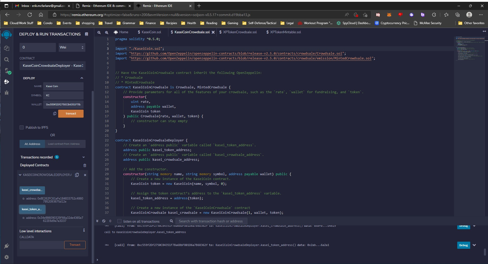
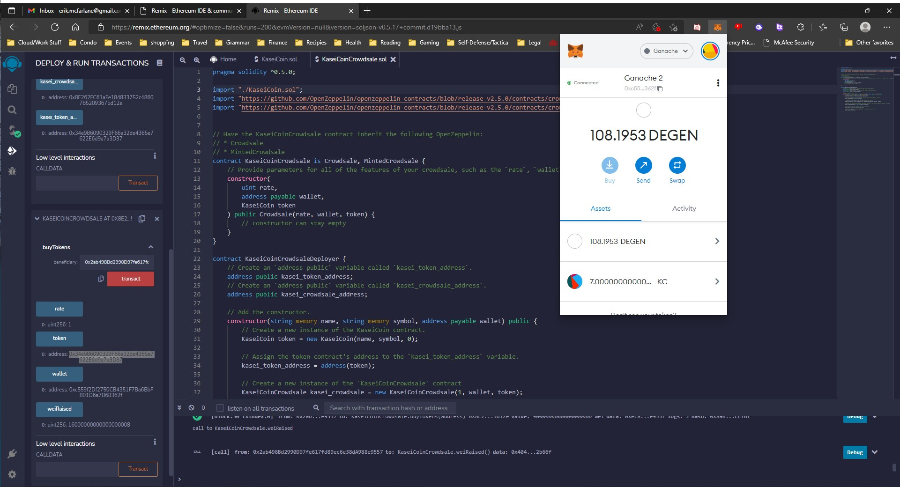

# adv-solidity-hw

## Methodology:

1. Complete code and compile:
Successful compile of KaseiCoin file

Successful compile of KaseiCoinCrowdsale file

2. Deploy Crowdsale contract & KaseiCoin contract

3. Mint from two different accounts
Mint 7 KC from 1st wallet

## Withdraw Account 2

Notice at the bottom left total weiRaised is 16000000000000000000wei the correct combination of the 7000000000000000000wei (1st wallet) and 9000000000000000000wei from the second wallet.  Also notice in the first wallet (where I deployed the contract) 9"ETH"(DEGEN) was deposited from the 2nd wallet transaction.
